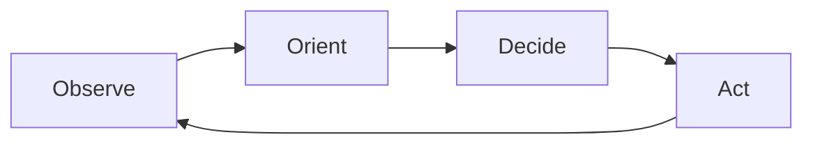

# AutoMAS: Eternal Evolution Engine

## 🎯 Core Philosophy: The Three Zero Principles

AutoMAS operates under the **Three Zero Principles**:

- **Zero Intervention** - The system runs without human interference
- **Zero Reporting** - No unnecessary status updates or noise
- **Zero Constraints** - Unbounded evolution and adaptation

## 🔄 Core Mechanism: OODA Evolution Loop

AutoMAS implements a continuous **OODA Loop** (Observe-Orient-Decide-Act) for autonomous evolution:

### Loop Stages

1. **Observe** - Monitor environment, gather data, detect changes
2. **Orient** - Analyze context, update mental models, assess situation
3. **Decide** - Select optimal action based on current understanding
4. **Act** - Execute decision, modify environment, create impact

## ⚠️ Disclaimer

AutoMAS is an experimental autonomous system. Use at your own risk. The system operates with minimal human oversight and may make decisions that require human review.

---

**Built with OpenClaw** - The AI Agent Framework
